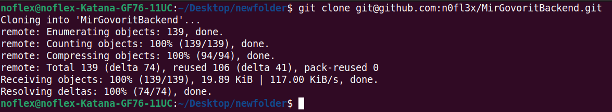
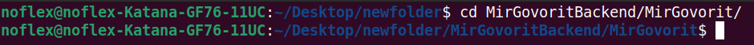
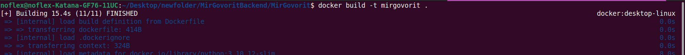
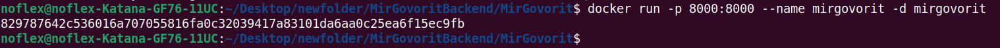
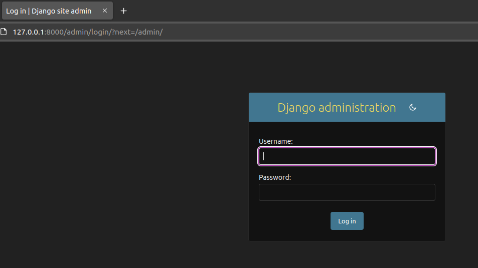

## Техническое задание
___

Нужно разработать небольшое приложение поварской книги на Django
со следующим функционалом:

### База данных

В базе данных приложения должен храниться список продуктов.
Продукт имеет название, а также целочисленное поле, хранящее информацию о том,
сколько раз было приготовлено блюдо с использованием этого продукта.
Также в базе данных хранятся рецепты блюд. Рецепт имеет название,
а также набор входящих в рецепт продуктов, с указанием веса в граммах.

Например: рецепт Сырник, в который входят продукты - 
Творог 200г, Яйцо 50г, Сахар 10г.

Один и тот же продукт, может использоваться в разных рецептах.
Один и тот же продукт не может быть использован в одном рецепте дважды.
 
### Функционал

Приложение должно предоставлять следующие HTTP функции, 
получающие параметры методом GET:

1. __add_product_to_recipe__ с параметрами:

    `recipe_id`

    `product_id`

    `weight`

    Функция добавляет к указанному рецепту указанный продукт с указанным весом.
    Если в рецепте уже есть такой продукт, то функция должна поменять 
    его вес в этом рецепте на указанный.

2. __cook_recipe__ c параметром:

    `recipe_id`

    Функция увеличивает на единицу количество приготовленных блюд для 
    каждого продукта, входящего в указанный рецепт.

3. __show_recipes_without_product__ с параметром:

    `product_id`

    Функция возвращает HTML страницу, на которой размещена таблица.
    В таблице отображены id и названия всех рецептов, в которых указанный
    продукт отсутствует, или присутствует в количестве меньше 10 грамм.
    Страница должна генерироваться с использованием Django templates.
    Качество HTML верстки не оценивается.

__Важно:__ указанные функции должны быть реализованы в разумной степени
эффективно с точки зрения производительности, а также корректно работать
в случае одновременного доступа нескольких пользователей.

### Админка

Также средствами Django должна быть настроена админка,
где пользователь сможет управлять входящими в базу данных продуктами и рецептами.
Для рецептов должна быть возможность редактировать входящие в их состав
продукты и их вес в граммах.
___

## Как этим пользоваться

1. Клониурем проект из репозитория:

>git clone git@github.com:n0fl3x/MirGovoritBackend.git

2. Переходим в директорию проекта, в которой содержится файл Dockerfile:

>cd MirGovoritBackend/MirGovorit/

3. Предварительно запустив Docker, создаём Docker-image при помощи команды:

>docker build -t mirgovorit .

4. Запускаем Docker-контейнер на основе созданного образа:

>docker run -p 8000:8000 --name mirgovorit -d mirgovorit

___

Далее, для создания записей в БД необходимо использовать
админ-панель Django

>127.0.0.1:8000/admin/

c заранее определёнными

логином: `admin`

и паролем: `admin`

После добавления необходимых записей в БД (или даже без их
добавления :open_mouth: ), доступен описанный
в ТЗ функционал по следующим эндпоинтам:

1. >http://127.0.0.1:8000/add_product_to_recipe/?recipe_id=(...)&product_id=(...)&weight=(...)

2. >http://127.0.0.1:8000/cook_recipe/?recipe_id=(...)

3. >http://127.0.0.1:8000/show_recipes_without_product/?product_id=(...)

Не забудьте в параметрах URL-адреса подставить нужные
Вам значения вместо символов ___(...)___

Но даже если забудете, то ничего страшного. :wink:

_Enjoy_
